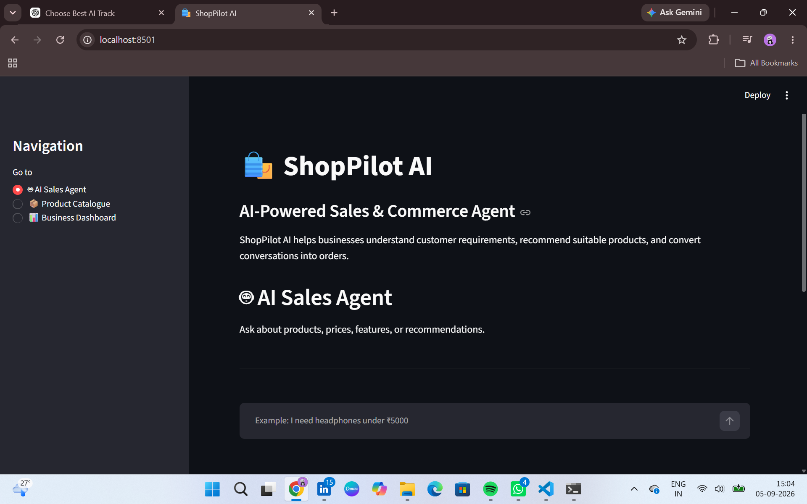
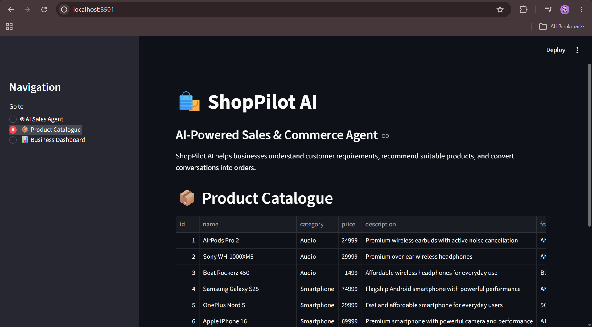
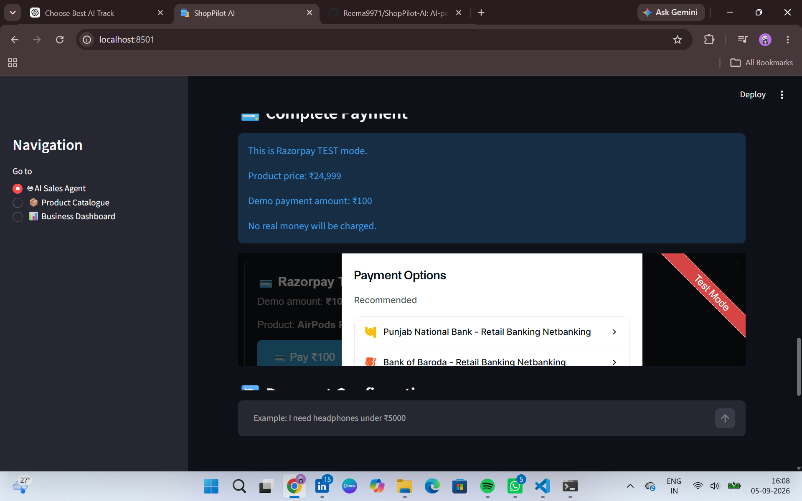
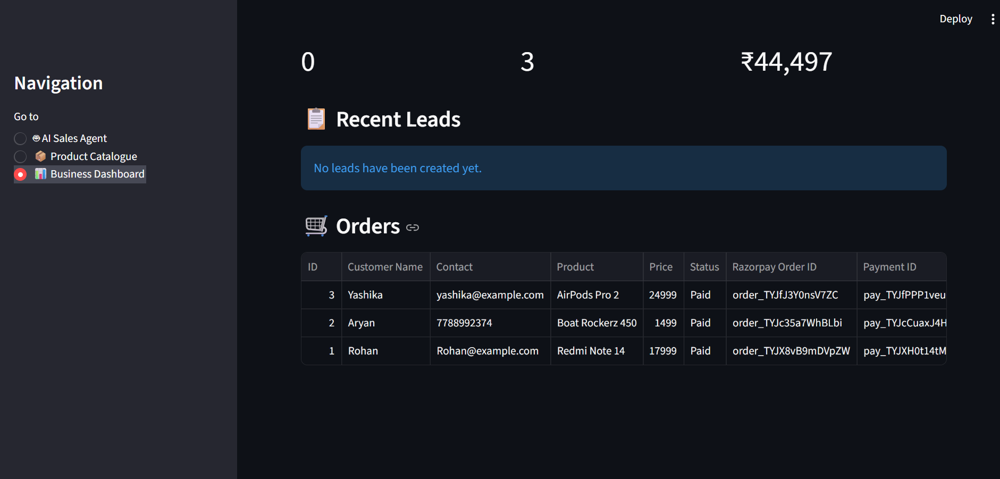
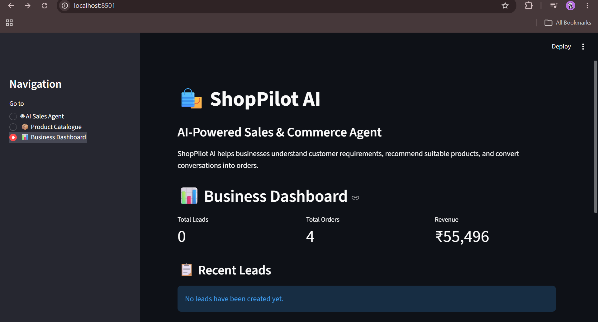

# ShopPilot AI 🛍️

## AI-Powered Sales & Commerce Agent

ShopPilot AI is an AI-powered commerce assistant designed to help small businesses handle customer product enquiries, recommend suitable products, manage leads and orders, and process payments.

The idea behind the project is simple: instead of customers searching through a product catalogue manually, they can describe what they need in natural language and the AI sales agent can help them find a suitable product.

For example:

> "I want a smartphone under ₹35,000"

The system understands the requirement, checks the available products, considers the customer's budget and recommends a suitable option.

---

## Problem

Small businesses often have to handle customer enquiries, product recommendations, orders, and inventory manually.

This can become difficult when multiple customers are asking questions at the same time. Customers may also leave if they do not receive a quick response.

Traditional chatbots can answer questions, but they may not reliably follow business rules such as:

- Customer budget
- Product category
- Product availability
- Stock limits
- Purchase intent
- Order and payment status

ShopPilot AI addresses this problem by combining conversational AI with deterministic business logic.

---

## Solution

ShopPilot AI provides a conversational sales agent that can understand customer requirements and guide them through the purchasing process.

The system:

1. Understands the customer's requirement.
2. Identifies the relevant category and budget.
3. Searches the product catalogue.
4. Checks product availability and stock.
5. Recommends suitable products.
6. Detects purchase intent.
7. Creates an order.
8. Processes a Razorpay test payment.
9. Verifies the payment.
10. Updates the order status.
11. Stores the payment ID.
12. Reduces product stock.
13. Displays the updated information in the business dashboard.

---

## Features

- 🤖 AI-powered conversational sales agent
- 🔎 Natural-language product search
- 💰 Budget-based product recommendations
- 🏷️ Category-based product matching
- 📦 Product availability and stock checking
- 🧠 Conversation context
- 🛒 Purchase intent detection
- 👤 Customer lead management
- 📝 Order creation and management
- 💳 Razorpay Test Mode payment integration
- ✅ Payment verification
- 🧾 Payment ID storage
- 📉 Automatic stock reduction after successful payment
- 📊 Business dashboard
- 💾 SQLite-based data storage
- 🔐 Environment-based configuration for sensitive credentials

---

## Tech Stack

| Technology | Purpose |
|---|---|
| Python | Core application logic |
| Streamlit | Web interface and business dashboard |
| Llama 3.2 | Local LLM for conversational AI |
| SQLite | Products, leads and orders database |
| Razorpay | Test payment processing |
| CSV | Product catalogue |
| uv | Python environment and dependency management |

---

## Architecture

```text
                    Customer
                       │
                       ▼
              Streamlit Interface
                       │
                       ▼
             Conversation Context
                       │
             ┌─────────┴─────────┐
             │                   │
             ▼                   ▼
      Business Rules          Llama 3.2
             │                   │
       ┌─────┼─────┐             │
       │     │     │             │
    Budget Category Stock         │
       │     │     │             │
       └─────┴─────┴──────┬──────┘
                           │
                           ▼
                 Product Recommendation
                           │
                           ▼
                    Purchase Intent
                           │
                           ▼
                     Order Creation
                           │
                           ▼
                  Razorpay Test Payment
                           │
                           ▼
                    Payment Verification
                           │
                           ▼
                     SQLite Database
                           │
                           ▼
                  Business Dashboard
```

---

## Demo Screenshots

### 🤖 AI Sales Agent


### 📦 Product Catalogue


### 💳 Razorpay Test Payment


### 🔄 Payment Confirmation


### 📊 Business Dashboard


---